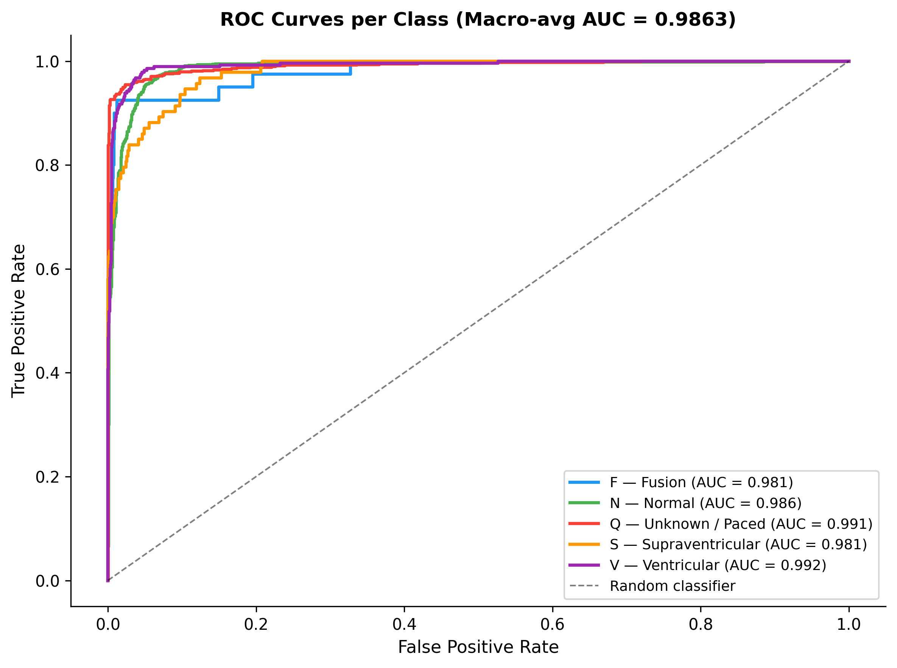

# 🫀 ECG Arrhythmia Classification with Explainable AI Dashboard

An end-to-end **ECG Arrhythmia Classification system** combining **deep learning**, **Explainable AI (Grad-CAM + SHAP)**, and an interactive **Streamlit dashboard**.

This system not only predicts arrhythmia classes but also **explains model decisions by highlighting important regions of the ECG signal**, improving transparency and clinical relevance.

---

## 🚀 Key Features

* Multi-class ECG classification using **AAMI-standard grouped classes**.
* 1D CNN optimized for **temporal signal learning** (ideal for low-power edge deployment).
* **Grad-CAM visualization** for class-level interpretability.
* **SHAP feature attribution** for sample-level explanation.
* **Automatic beat segmentation** from raw multi-beat ECG signals.
* **Majority voting** across all detected beats for signal-level diagnosis, including vital **Incidental Finding alerts**.
* Interactive **Streamlit dashboard** for real-time ECG upload, prediction, and explanation.
* Full pipeline implemented in a **single, reproducible Jupyter Notebook**.

---

## 📊 Quantitative Results & Clinical Validation

The model has been rigorously evaluated on a held-out test set from the MIT-BIH dataset, going beyond simple point-accuracy to prove statistical stability and physiological alignment.

### Predictive Robustness & Accuracy Metrics
* **Overall Accuracy:** `92.72%`
* **Statistical Stability:** `95% CI: 91.6% – 93.7%` (Calculated via 1,000-iteration test-set bootstrapping).
* **Macro ROC-AUC:** `0.986` (Demonstrating exceptional class separability).

### Predictive Robustness & Accuracy Metrics
* **Overall Accuracy:** `92.72%`
* **Statistical Stability:** `95% CI: 91.6% – 93.7%` (Calculated via 1,000-iteration test-set bootstrapping).
* **Macro ROC-AUC:** `0.986` (Demonstrating exceptional class separability).



**Detailed Performance Metrics by AAMI Class:**

| Class | Description | Precision | Recall | F1-Score | AUC |
| :--- | :--- | :--- | :--- | :--- | :--- |
| **N** | Normal Beat | 0.9421 | 0.9760 | 0.9587 | 0.985 |
| **S** | Supraventricular | 0.9365 | 0.6344 | 0.7564 | 0.975 |
| **V** | Ventricular | 0.8904 | 0.9640 | 0.9257 | 0.995 |
| **F** | Fusion | 0.8387 | 0.6500 | 0.7324 | 0.981 |
| **Q** | Unknown / Paced | 0.9814 | 0.9560 | 0.9685 | 0.993 |

*Note: A **Normalized Confusion Matrix** is generated during model training (saved at 300 DPI). It mathematically illustrates that the model's rare misclassifications occur primarily between physiologically and structurally similar classes (e.g., Fusion beats naturally sharing morphology with Normal and Ventricular beats).*


---

## 🧠 Project Workflow

```text
Raw ECG → Bandpass Filter → R-peak Detection → Beat Segmentation → CNN → Per-Beat Classification → Majority Vote → Dashboard
```

---

## 📂 Dataset & Citations

This project uses the **MIT-BIH Arrhythmia Database** accessed via PhysioNet. The raw annotations are aggregated into the five overarching super-classes defined by the AAMI standard (`N`, `S`, `V`, `F`, `Q`). 

If you utilize this data or pipeline, please ensure you cite the original dataset creators:
1. G. B. Moody and R. G. Mark, *"The impact of the MIT-BIH Arrhythmia Database,"* IEEE Eng. Med. Biol. Mag., vol. 20, no. 3, pp. 45-50, May-June 2001.
2. A. L. Goldberger et al., *"PhysioBank, PhysioToolkit, and PhysioNet: Components of a new research resource for complex physiologic signals,"* Circulation, vol. 101, no. 23, pp. e215-e220, June 2000.

---

## 🧪 Usage (Streamlit Dashboard)

### 1. Standard Usage
1. Launch the Streamlit app via `streamlit run app.py`.
2. Upload an ECG CSV (must contain a single numeric signal column, sampled at 360 Hz).
3. Select the correct ECG column from the sidebar to view the automated clinical report, including SHAP mapping and majority voting.

### 2. Testing with the Sample Data
To immediately test the dashboard's capabilities without needing your own clinical data, use the provided `app/sample_ecg.csv` file. 

* **What it is:** A 15-second, 360 Hz continuous signal containing 18 mixed beats.
* **Clinical Scenario:** It represents a predominantly Normal rhythm (13 `N` beats) peppered with rare abnormalities (2 `V`, 2 `S`, 1 `F`). 
* **Expected Output:** Loading this file will demonstrate the dashboard's critical **"Incidental Finding" alert**, correctly proving that the system will flag the hidden Ventricular and Supraventricular ectopic beats even when the overarching "Majority Vote" diagnosis is strictly Normal.

---

## 🛠 Tech Stack

* **Language:** Python 3.11
* **Deep Learning:** TensorFlow 2.18 / Keras 3
* **DSP & Data:** NumPy, Pandas, SciPy, WFDB
* **Explainability:** SHAP (`GradientExplainer` / `DeepExplainer`)
* **Visualization:** Matplotlib, Seaborn, Plotly
* **Frontend:** Streamlit

---

## 🔁 Reproducibility

* Fixed random seed configuration ensures consistent results.
* Stratified splits preserve severe clinical class imbalances across training and testing.
* Class imbalance handled via weighted categorical cross-entropy loss.

**To reproduce the environment:**
1. Download the MIT-BIH dataset to `data/raw/mitdb/`.
2. Run all cells in `model_training.ipynb` to process the data, train the CNN, and generate the XAI metrics.
3. Launch the dashboard via `streamlit run app.py`.
