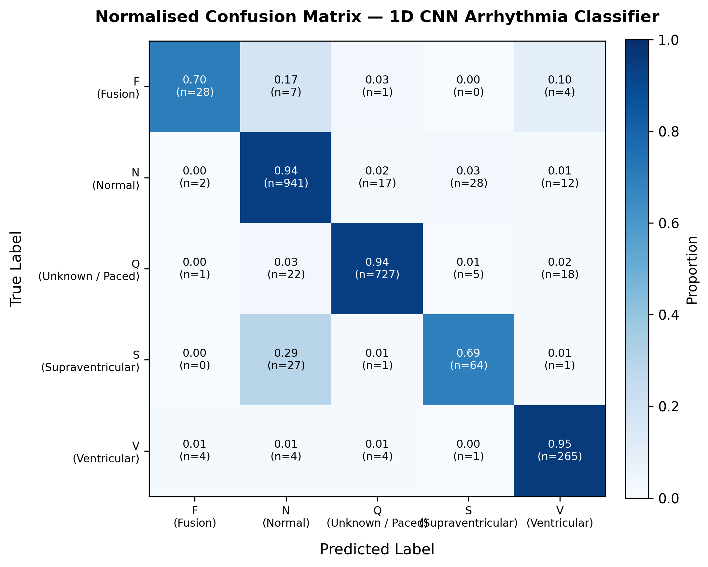
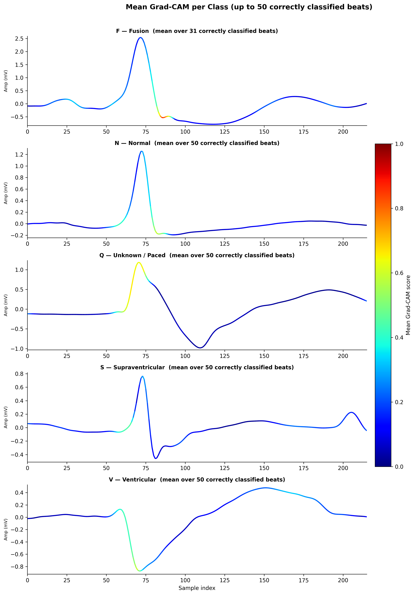
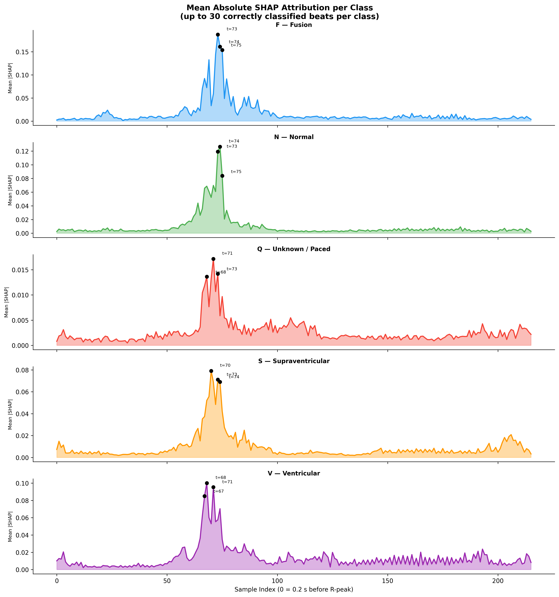

# 🫀 ECG Arrhythmia Classification with Explainable AI Dashboard

An end-to-end **ECG Arrhythmia Classification system** combining **deep learning**, **Explainable AI (Grad-CAM + SHAP)**, and an interactive **Streamlit dashboard**.

This system not only predicts arrhythmia classes but also **explains model decisions by highlighting important regions of the ECG signal**, improving transparency and clinical relevance.

---

## 🚀 Key Features

* Multi-class ECG classification using **AAMI-standard grouped classes**
* 1D CNN optimized for **temporal signal learning**
* **Grad-CAM visualization** for class-level interpretability
* **SHAP feature attribution** for sample-level explanation
* **Automatic beat segmentation** from raw multi-beat ECG signals
* **Majority voting** across all detected beats for signal-level diagnosis
* Interactive **Streamlit dashboard**
* Real-time ECG upload, prediction, and explanation
* Full pipeline implemented in a **single Jupyter Notebook**
* **Publication-ready figures** — normalised confusion matrix, per-class Grad-CAM heatmaps, and mean SHAP attribution plots saved at 300 DPI

---

## 🧠 Project Workflow

```text
Raw ECG → Bandpass Filter → R-peak Detection → Beat Segmentation → CNN → Per-Beat Classification → Majority Vote → Dashboard
```

---

## 📂 Dataset

This project uses the **MIT-BIH Arrhythmia Database** from PhysioNet.

* **URL:** [https://physionet.org/content/mitdb/](https://physionet.org/content/mitdb/)

---

## 📜 Citations & Acknowledgments

When using this resource or the associated models, please cite the following original publications:

### Primary Dataset Citation
>
> Moody, G. B., & Mark, R. G. (2001). **The impact of the MIT-BIH Arrhythmia Database.** *IEEE Engineering in Medicine and Biology Magazine*, 20(3), 45-50. PMID: 11446209.

### PhysioNet Resource Citation
>
> Goldberger, A., Amaral, L., Glass, L., Hausdorff, J., Ivanov, P. C., Mark, R., ... & Stanley, H. E. (2000). **PhysioBank, PhysioToolkit, and PhysioNet: Components of a new research resource for complex physiologic signals.** *Circulation* [Online]. 101 (23), pp. e215–e220. RRID:SCR_007345.

---

### Download Dataset

```python
import wfdb

wfdb.dl_database("mitdb", "data/raw/mitdb")
```

### Or Stream Directly

```python
record = wfdb.rdrecord("100", pn_dir="mitdb")
annotation = wfdb.rdann("100", "atr", pn_dir="mitdb")
```

> ⚠️ Dataset is not included in this repository due to size constraints.

---

## 🧪 Data Preprocessing

* Bandpass filtering (**0.5–40 Hz**)
* R-peak based segmentation:

  * **0.2 s before R-peak**
  * **0.4 s after R-peak**
* Input size: **216 samples per beat (360 Hz)**
* Signals normalized to zero mean and unit variance

---

## 🏷 Dataset Labeling (AAMI Standard)

Raw MIT-BIH annotations (23 classes) are grouped into 5 clinically meaningful categories:

| Class | Description                |
| ----- | -------------------------- |
| **N** | Normal                     |
| **S** | Supraventricular           |
| **V** | Ventricular                |
| **F** | Fusion                     |
| **Q** | Unknown / Paced / Artifact |

---

## 🧠 Model Architecture (1D CNN)

```
Conv1D → BatchNorm → MaxPooling  
Conv1D → BatchNorm → MaxPooling  
Conv1D → BatchNorm → GlobalAvgPooling  
Dense → Dropout → Softmax
```

### Training Details

* Optimizer: **Adam**
* Learning rate: **1e-3**
* Loss: **Categorical Crossentropy**
* Batch size: **64**
* Epochs: **30 (Early stopping applied)**
* Class imbalance handled using **class weights**
* Train / Validation / Test split: **80 / 10 / 10 (stratified)**

---

## 🔍 Explainability

### Grad-CAM

Grad-CAM computes gradients of the target class score with respect to feature maps in the final convolutional layer, producing a **temporal importance map** highlighting which parts of the ECG signal influenced the prediction.

### SHAP (SHapley Additive exPlanations)

SHAP uses a `GradientExplainer` with a zero-signal baseline to compute the **exact numerical contribution of each time point** to the predicted class. This complements Grad-CAM by providing sample-level, directional attribution (positive = pushes toward prediction, negative = pushes against).

### Key Observations

* **N (Normal):** Focus on sharp QRS complex
* **V (Ventricular):** Broad QRS region
* **S (Supraventricular):** Attention includes pre-QRS (P-wave)
* **F (Fusion):** Mixed morphology attention
* **Q (Unknown):** Irregular or spike-like regions

👉 The model learns **physiological patterns, not noise**

---

## 📊 Results & Performance

### Overall

| Metric                | Value      |
| --------------------- | ---------- |
| **Accuracy**          | **94.28%** |
| **Macro F1-score**    | 0.884      |
| **Weighted F1-score** | 0.943      |

---

### Class-wise Performance

| Class | Precision | Recall | F1-score | Support |
| ----- | --------- | ------ | -------- | ------- |
| F     | 0.83      | 0.75   | 0.79     | 40      |
| N     | 0.96      | 0.94   | 0.95     | 1000    |
| Q     | 0.97      | 0.96   | 0.96     | 773     |
| S     | 0.73      | 0.85   | 0.79     | 93      |
| V     | 0.91      | 0.95   | 0.93     | 278     |

---

## 📈 Publication-Ready Figures

Three figures are generated and saved to `images/` at 300 DPI by the notebook:

### Figure 1 — Normalised Confusion Matrix


Each cell shows the proportion of predictions alongside the raw count (n=...)`, with row-wise normalisation so class imbalance does not skew the visual.

---

### Figure 2 — Per-Class Grad-CAM Heatmaps


Mean Grad-CAM heatmap averaged over up to 50 correctly classified beats per class. The jet colormap encodes attention intensity — red regions indicate where the model focused most when making its decision.

---

### Figure 3 — Mean Absolute SHAP Attribution per Class


Mean absolute SHAP value per timestep averaged over up to 30 correctly classified beats per class. The top-3 most important timesteps are annotated. This reveals which regions of the 216-sample window (centred on the R-peak) are the primary decision drivers for each arrhythmia type.

---

## 📁 Repository Structure

```text
├── model_training.ipynb        ← Full training, evaluation & figure generation
├── models/
│   ├── cnn_ecg_best.keras      ← Best checkpoint (used by app)
│   └── cnn_ecg_final.keras     ← Final epoch weights
│
├── app/
│   ├── app.py                  ← Streamlit dashboard
│   └── sample_ecg.csv          ← Synthetic 15s test signal (360 Hz, single column)
│
├── images/
│   ├── confusion_matrix_normalised.png   
│   ├── gradcam_per_class.png             
│   └── shap_mean_per_class.png           
│
├── requirements.txt
└── README.md
```

> ⚠️ **Note:** The `models/` folder sits at the project root, one level above `app/`. The app resolves the model path automatically using `os.path.dirname(os.path.abspath(__file__))` + `../models/`.

---

## ⚙️ Installation

```bash
git clone https://github.com/Sanugiw/ECG-Arrhythmia-Classifier.git
cd ECG-Arrhythmia-Classifier

python -m venv .venv
.venv\Scripts\activate

pip install -r requirements.txt
```

---

## 🚀 How to Run

### 1. Run the Notebook

Open:

```
model_training.ipynb
```

Run all cells to:

* Load and preprocess ECG data
* Segment and label beats
* Train the 1D CNN
* Evaluate performance
* Generate and save all three publication-ready figures
* Save the trained model

---

### 2. Run the App

```bash
streamlit run app/app.py
```

---

### 3. Test the App

Upload `app/sample_ecg.csv` — a synthetic 15-second, 360 Hz signal containing 18 beats.

Or provide your own signal in CSV format:

```csv
ecg
0.01
0.02
-0.03
...
```

The signal must be a **single numeric column sampled at 360 Hz**. The app will automatically filter, detect R-peaks, segment beats, and classify each one.

---

## 🧪 Usage

1. Launch the Streamlit app
2. Upload ECG CSV (single column, 360 Hz)
3. Select the ECG column from the sidebar
4. View:

   * Full signal waveform with per-beat annotations coloured by class
   * Per-beat classification table with confidence scores
   * Majority vote result and beat count breakdown
   * Mean probability distribution across all 5 classes
   * SHAP feature attribution for the representative beat (enable via sidebar)
   * Automated clinical summary with incidental finding alerts

---

## 🛠 Tech Stack

* Python 3.11
* TensorFlow 2.18 / Keras 3
* NumPy, Pandas, SciPy
* SHAP (`GradientExplainer`)
* Matplotlib, Seaborn, Plotly
* Streamlit
* WFDB

---

## 🔁 Reproducibility

* Fixed random seed for consistent results
* Stratified splits preserve class distribution
* Class imbalance handled via weighted loss

To reproduce:

1. Download the dataset
2. Run all cells in `model_training.ipynb`
3. Launch the Streamlit app

---

## 📌 Summary

This project integrates:

* Deep learning for ECG classification
* Explainable AI (Grad-CAM + SHAP)
* Automatic beat segmentation and majority voting
* Interactive deployment

to create a system that is both **accurate and interpretable**, suitable for:

* Clinical decision support
* Biomedical research
* Educational tools

---
