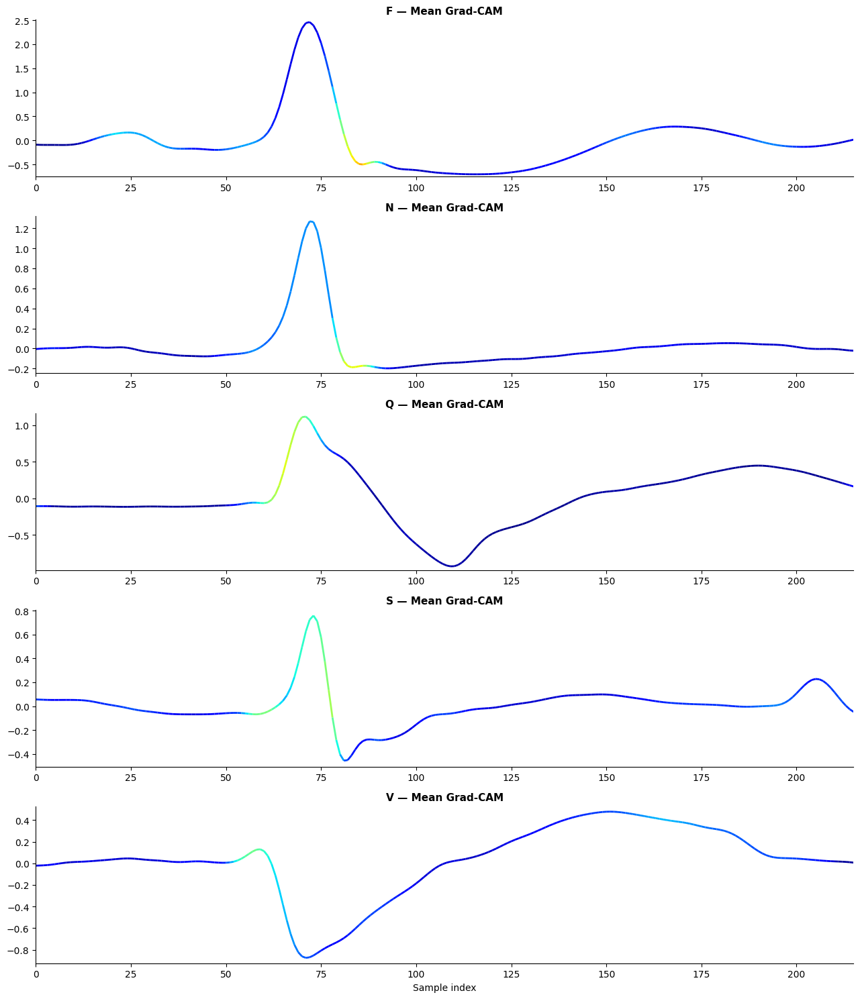

# 🫀 ECG Arrhythmia Classification with Explainable AI Dashboard

An end-to-end **ECG Arrhythmia Classification system** combining **deep learning**, **Explainable AI (Grad-CAM)**, and an interactive **Streamlit dashboard**.

This system not only predicts arrhythmia classes but also **explains model decisions by highlighting important regions of the ECG signal**, improving transparency and clinical relevance.

---

## 🚀 Key Features

* Multi-class ECG classification using **AAMI-standard grouped classes**
* 1D CNN optimized for **temporal signal learning**
* **Grad-CAM visualization** for interpretability
* Interactive **Streamlit dashboard**
* Real-time ECG upload, prediction, and explanation
* Full pipeline implemented in a **single Jupyter Notebook**

---

## 🧠 Project Workflow

```
Raw ECG → Filtering → Segmentation → Label Mapping → CNN → Prediction → Grad-CAM → Dashboard
```

---

## 📂 Dataset

This project uses the **MIT-BIH Arrhythmia Database** from PhysioNet:

🔗 https://physionet.org/content/mitdb/

### Download Dataset

```python
import wfdb

wfdb.dl_database("mitdb", "data/raw/mitdb")
```

### Or Stream Directly

```python
record = wfdb.rdrecord("100", pn_dir="mitdb")
annotation = wfdb.rdann("100", "atr", pn_dir="mitdb")
```

> ⚠️ Dataset is not included in this repository due to size constraints.

---

## 🧪 Data Preprocessing

* Bandpass filtering (**0.5–40 Hz**)
* R-peak based segmentation:

  * **0.2 s before R-peak**
  * **0.4 s after R-peak**
* Input size: **216 samples per beat (360 Hz)**
* Signals normalized to zero mean and unit variance

---

## 🏷 Dataset Labeling (AAMI Standard)

Raw MIT-BIH annotations (23 classes) are grouped into 5 clinically meaningful categories:

| Class | Description                |
| ----- | -------------------------- |
| **N** | Normal                     |
| **S** | Supraventricular           |
| **V** | Ventricular                |
| **F** | Fusion                     |
| **Q** | Unknown / Paced / Artifact |

---

## 🧠 Model Architecture (1D CNN)

```
Conv1D → BatchNorm → MaxPooling  
Conv1D → BatchNorm → MaxPooling  
Conv1D → BatchNorm → GlobalAvgPooling  
Dense → Dropout → Softmax
```

### Training Details

* Optimizer: **Adam**
* Learning rate: **1e-3**
* Loss: **Categorical Crossentropy**
* Batch size: **64**
* Epochs: **30 (Early stopping applied)**
* Class imbalance handled using **class weights**
* Train / Validation / Test split: **80 / 10 / 10 (stratified)**

---

## 🔍 Explainability (Grad-CAM)

Grad-CAM computes gradients of the target class score with respect to feature maps in the final convolutional layer.

This produces a **temporal importance map** highlighting which parts of the ECG signal influenced the prediction.

### Key Observations

* **N (Normal):** Focus on sharp QRS complex
* **V (Ventricular):** Broad QRS region
* **S (Supraventricular):** Attention includes pre-QRS (P-wave)
* **F (Fusion):** Mixed morphology attention
* **Q (Unknown):** Irregular or spike-like regions

👉 The model learns **physiological patterns, not noise**

---

## 📊 Results & Performance

### Overall

| Metric                | Value      |
| --------------------- | ---------- |
| **Accuracy**          | **94.28%** |
| **Macro F1-score**    | 0.884      |
| **Weighted F1-score** | 0.943      |

---

### Class-wise Performance

| Class | Precision | Recall | F1-score | Support |
| ----- | --------- | ------ | -------- | ------- |
| F     | 0.83      | 0.75   | 0.79     | 40      |
| N     | 0.96      | 0.94   | 0.95     | 1000    |
| Q     | 0.97      | 0.96   | 0.96     | 773     |
| S     | 0.73      | 0.85   | 0.79     | 93      |
| V     | 0.91      | 0.95   | 0.93     | 278     |

---

## 📈 Visualization



---

## 📁 Repository Structure

```
├── model_training.ipynb   
├── app/
│   ├── app.py
│   └── sample_ecg.csv
│
├── images/
│   └── gradcam_results.png
│
├── requirements.txt
└── README.md
```

---

## ⚙️ Installation

```bash
git clone https://github.com/Sanugiw/ECG-Arrhythmia-Classifier.git
cd ECG-Arrhythmia-Classifier

python -m venv .venv
.venv\Scripts\activate

pip install -r requirements.txt
```

---

## 🚀 How to Run

### 1. Run the Notebook

Open:

```
model_training.ipynb
```

Run all cells to:

* Load ECG data
* Preprocess signals
* Extract beats
* Map labels
* Train CNN model
* Evaluate performance
* Save trained model

---

### 2. Run the App

```bash
streamlit run app/app.py
```

---

### 3. Test the App

Upload a CSV:

```csv
ecg
0.01
0.02
-0.03
...
```

Or use:

```
app/sample_ecg.csv
```

---

## 🧪 Usage

1. Launch the Streamlit app
2. Upload ECG CSV (single column)
3. Select ECG column
4. View:

   * ECG waveform
   * Predicted class
   * Confidence scores
   * Grad-CAM visualization

---

## 🛠 Tech Stack

* Python
* TensorFlow / Keras
* NumPy, Pandas
* SciPy
* Matplotlib
* Streamlit
* WFDB

---

## 🔁 Reproducibility

* Fixed random seed for consistent results
* Stratified splits preserve class distribution
* Class imbalance handled via weighted loss

To reproduce:

1. Download the dataset
2. Run all cells in `model_training.ipynb`
3. Launch Streamlit app

---

## 📌 Summary

This project integrates:

* Deep learning for ECG classification
* Explainable AI (Grad-CAM)
* Interactive deployment

to create a system that is both **accurate and interpretable**, suitable for:

* Clinical decision support
* Biomedical research
* Educational tools

